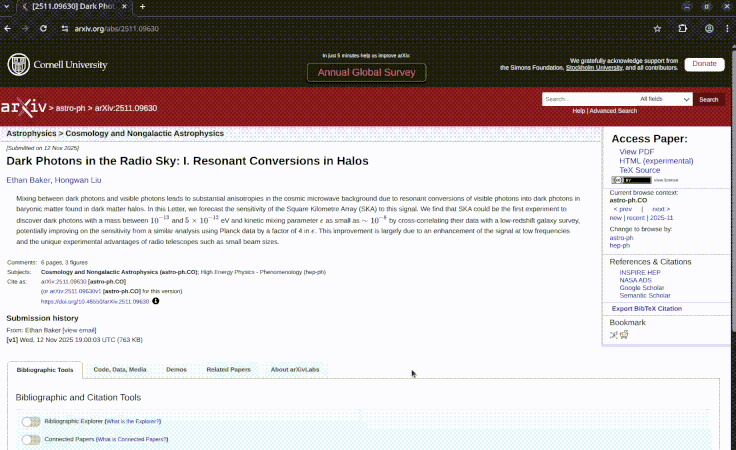

# 🔭 hoverscope

**Hover over telescope and satellite names on arXiv to see key specifications instantly.**

Hoverscope is a browser extension that detects mentions of telescopes, satellites, and astronomical instruments in arXiv papers and displays detailed information when you hover over them.



## Features

- ✨ **Instant Information**: Hover over instrument names to see specifications
- 🔄 **Auto-updating**: Database updates automatically from GitHub
- 🌓 **Dark Mode**: Adapts to your system preferences
- 📚 **Comprehensive**: Covers major space/ground telescopes and instruments
- 🎯 **arXiv Optimized**: Works seamlessly on paper titles, abstracts, and content

## Information Displayed

For each telescope/satellite, Hoverscope shows:
- **Type** (Space telescope, radio interferometer, etc.)
- **Launch Date** (or operational dates)
- **Wavelength Coverage** (UV, visible, infrared, radio, etc.)
- **Survey Area** (for survey instruments)
- **Location** (orbit, ground location)
- **Status** (Operational, decommissioned, in development)
- **Brief Description**

## Installation

### Chrome/Edge/Brave

1. Download this repository as a ZIP file and extract it
2. Open Chrome and go to `chrome://extensions/`
3. Enable "Developer mode" (toggle in top-right)
4. Click "Load unpacked"
5. Select the `hoverscope` folder
6. Done! Visit arXiv and hover over telescope names

### Firefox

1. Download this repository as a ZIP file and extract it
2. Open Firefox and go to `about:debugging#/runtime/this-firefox`
3. Click "Load Temporary Add-on"
4. Navigate to the `hoverscope` folder and select `manifest.json`
5. Done! (Note: temporary add-ons are removed when Firefox restarts)

For permanent Firefox installation, the extension needs to be signed by Mozilla or you need to use Firefox Developer Edition with `xpinstall.signatures.required` set to `false`.

## Usage

Just browse arXiv normally! Hoverscope automatically detects telescope and satellite names in:
- Paper titles
- Abstracts
- Author lists
- Full paper content

When you hover over a recognized name (like "JWST", "Hubble", "ALMA"), a tooltip appears with detailed information.

## Current Database

Hoverscope currently recognizes **30+ telescopes and instruments**, including:

**Space Telescopes:**
- James Webb Space Telescope (JWST)
- Hubble Space Telescope (HST)
- Chandra X-ray Observatory
- Spitzer Space Telescope
- Kepler
- TESS
- Gaia
- Euclid
- Nancy Grace Roman Space Telescope
- And more...

**Ground-Based:**
- ALMA
- VLA (Very Large Array)
- SKA (Square Kilometre Array)
- SDSS (Sloan Digital Sky Survey)
- Vera Rubin Observatory (LSST)

**Instruments:**
- JWST instruments (MIRI, NIRSpec, NIRCam)
- And more...

## Updating the Database

The extension automatically checks for database updates daily. The database is stored as a JSON file that can be easily updated.

### For Users

The database updates automatically! No action needed.

### For Maintainers

To add new telescopes or update information:

1. Edit `telescopes.json` following this format:

```json
{
  "telescope_id": {
    "name": "Official Name",
    "aliases": ["Alternative Name 1", "Acronym"],
    "type": "Space Telescope",
    "launch_date": "Month Day, Year",
    "wavelengths": "UV to near-infrared (100-2500 nm)",
    "survey_area": "5000 sq deg",
    "location": "L2 Lagrange Point",
    "status": "Operational",
    "description": "Brief description of the mission"
  }
}
```

2. Commit and push to your GitHub repository
3. Update the `DATABASE_URL` in `background.js` to point to your repository:
   ```javascript
   const DATABASE_URL = 'https://raw.githubusercontent.com/YOUR_USERNAME/hoverscope-data/main/telescopes.json';
   ```

Users' extensions will automatically fetch the updated database within 24 hours.

## Contributing

Want to add more telescopes or improve the extension? Contributions welcome!

1. Fork the repository
2. Add telescope data to `telescopes.json`
3. Test locally
4. Submit a pull request

## Technical Details

- **Manifest Version**: 3 (latest Chrome extension standard)
- **Framework**: Vanilla JavaScript (no dependencies)
- **Storage**: Chrome Storage API with automatic syncing
- **Update Mechanism**: Daily automatic checks via background service worker

## Privacy

Hoverscope:
- ✅ Only runs on arXiv.org
- ✅ Does not collect any user data
- ✅ Does not track browsing history
- ✅ Minimal permissions (storage only)
- ✅ All data processing happens locally in your browser

## License

MIT License - feel free to use, modify, and distribute!

## Credits

Telescope data compiled from NASA, ESA, and observatory official sources.

---

**Made with ❤️  (and claude) for the astronomy community**
